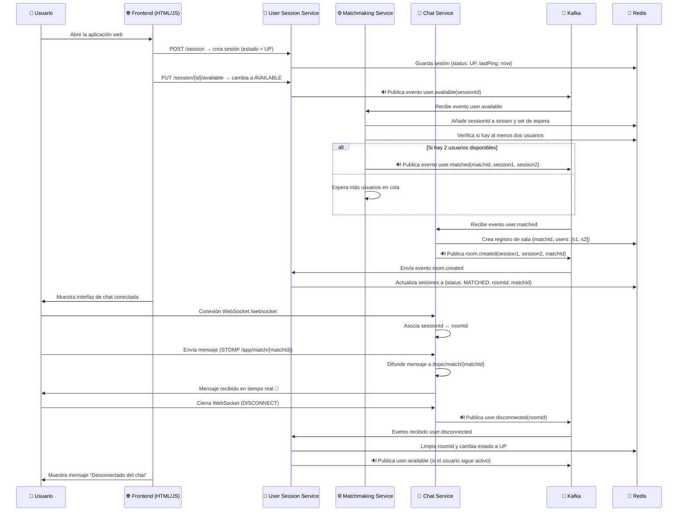

# Chat Anónimo — Sistema Distribuido con Spring Boot, Kafka y Redis

**Chat Anónimo** es una aplicación distribuida que permite a usuarios conectarse de forma aleatoria y conversar en tiempo real.
El sistema está compuesto por múltiples microservicios que coordinan registro de sesiones, matchmaking, creación de salas y mensajería WebSocket.

---

## Arquitectura General

El flujo completo abarca desde la conexión inicial del usuario hasta su desconexión, pasando por los siguientes componentes:

1. **User Session Service** – Maneja las sesiones de usuario (Redis + Kafka).
2. **Matchmaking Service** – Empareja usuarios disponibles automáticamente.
3. **Chat Service** – Crea salas y gestiona comunicación WebSocket.
4. **Eureka Server** – Registro de servicios para descubrimiento dinámico.
5. **Kafka Broker** – Canal de eventos entre servicios.
6. **Redis** – Almacenamiento reactivo y streams para colas de espera.

---

## Flujo del Sistema

### 1️⃣ Conexión de Usuario y Registro de Sesión

El usuario se conecta al sistema, se registra y cambia su estado a `AVAILABLE` para entrar al proceso de emparejamiento.

```java
// UserSessionController.java
userSessionOps.opsForValue()
    .set(key, session.withStatus(Status.UP).withLastPingNow())
```

* **Evento publicado:** `user.available` → Kafka.

---

### 2️⃣ Matchmaking Automático

El servicio de matchmaking escucha los eventos Kafka de usuarios disponibles, los agrega a una cola en Redis y busca pares compatibles.

```java
@KafkaListener(topics = "user.available", groupId = "matchmaking")
public void onUserAvailable(UserAvailableEvent event) { ... }
```

Cuando se encuentran dos usuarios:

* Se publica `user.matched` con los `sessionId` emparejados.
* Redis limpia la cola de espera.

---

### 3️⃣ Creación de Sala de Chat

El servicio de chat recibe el evento `user.matched`, crea una nueva sala (`matchId`) y notifica a ambos usuarios.

```java
@KafkaListener(topics = "user.matched", groupId = "chat-service")
public void onUserMatched(UserMatchedEvent event) {
    kafkaTemplate.send("room.created", new RoomCreatedEvent(...));
}
```

Luego:

* El **User Session Service** actualiza los usuarios a estado `MATCHED`.
* Asigna el `roomId` a sus sesiones Redis.

---

### 4️⃣ Comunicación en Tiempo Real (WebSocket)

Una vez creada la sala, los usuarios se comunican mediante WebSocket con soporte STOMP y broadcast por `/topic/match/{matchId}`.

```java
@MessageMapping("/match/{matchId}")
@SendTo("/topic/match/{matchId}")
public ChatMessage sendMessage(ChatMessage message) { ... }
```

El **Message Broker** interno distribuye los mensajes entre clientes conectados.

---

### 5️⃣ Desconexión y Limpieza

Cuando un usuario se desconecta del WebSocket:

* Se intercepta el evento `DISCONNECT`.
* Se publica `user.disconnected`.
* El servicio de sesiones devuelve su estado a `UP` y limpia el `roomId`.

```java
kafkaTemplate.send("user.disconnected", new UserDisconnectedEvent(roomId));
```

---

## Tecnologías Utilizadas

| Componente            | Descripción                            |
| --------------------- | -------------------------------------- |
| **Spring Boot**       | Framework principal de microservicios  |
| **Spring WebFlux**    | Modelo reactivo no bloqueante          |
| **Spring Kafka**      | Comunicación basada en eventos         |
| **Redis Reactive**    | Cache y almacenamiento de sesiones     |
| **WebSocket / STOMP** | Canal de comunicación en tiempo real   |
| **Eureka Server**     | Registro y descubrimiento de servicios |

---

## Ejecución Local

### Requisitos previos

* Docker y Docker Compose
* Java 21+
* Maven o Gradle
* Kafka
* Redis

## Flujo del Sistema



---

### Descripción paso a paso

| Etapa                   | Servicio                           | Acción                                                                 | Resultado                                               |
| ----------------------- | ---------------------------------- | ---------------------------------------------------------------------- | ------------------------------------------------------- |
| **1. Conexión**         | User Session                       | Crea sesión y la guarda en Redis con estado `UP`.                      | El usuario se registra en el sistema.                   |
| **2. Disponibilidad**   | User Session → Kafka → Matchmaking | Kafka envía el evento `user.available`.                                | El usuario entra en la cola de emparejamiento.          |
| **3. Emparejamiento**   | Matchmaking                        | Redis detecta dos usuarios disponibles.                                | Se publica `user.matched` con un nuevo `matchId`.       |
| **4. Creación de sala** | Chat Service                       | Kafka notifica, se crea la sala en Redis y se actualizan las sesiones. | Los usuarios reciben el `roomId` y se conectan al chat. |
| **5. Comunicación**     | Chat (WebSocket)                   | Los usuarios intercambian mensajes en `/topic/match/{matchId}`.        | Comunicación bidireccional en tiempo real.              |
| **6. Desconexión**      | Chat → Kafka → User Session        | Al salir, se publica `user.disconnected`.                              | Redis limpia la sesión y la deja lista para reconexión. |

---

### Resumen de los Tópicos Kafka

| Tópico              | Emisor       | Receptor     | Propósito                                     |
| ------------------- | ------------ | ------------ | --------------------------------------------- |
| `user.available`    | User Session | Matchmaking  | Notificar usuario listo para emparejar        |
| `user.matched`      | Matchmaking  | Chat Service | Crear sala entre dos usuarios                 |
| `room.created`      | Chat Service | User Session | Actualizar sesiones con el `roomId`           |
| `user.disconnected` | Chat Service | User Session | Restaurar estado del usuario al desconectarse |

---

* Cada usuario se conecta sin autenticación.
* El sistema encuentra automáticamente un compañero disponible.
* Ambos entran a una sala WebSocket compartida.
* Al desconectarse, la sesión se limpia y puede volver a emparejarse.
